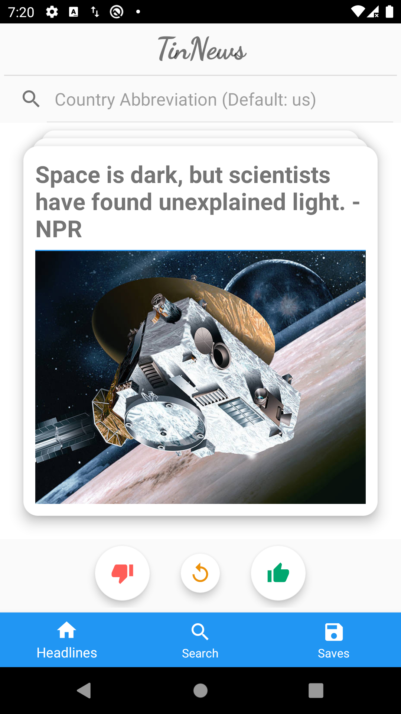

# TinNews
A Tinder-like Android news app that allows you to swip to like and skip. You can save the news articles too.

Based on Google Component Architectural MVVM Pattern

Implemented the bottom bar & page navigation using JetPack navigation component 

Utilized 3rd party CardStackView(RecyclerView) to support swipe gestures for liking/disliking the news

Built the Room Database with LiveData & ViewModel to support local cache and offline model

Integrated Retrofit and LiveData to pull the latest news data from a RESTFUL endpoint  (newsapi.org)  

